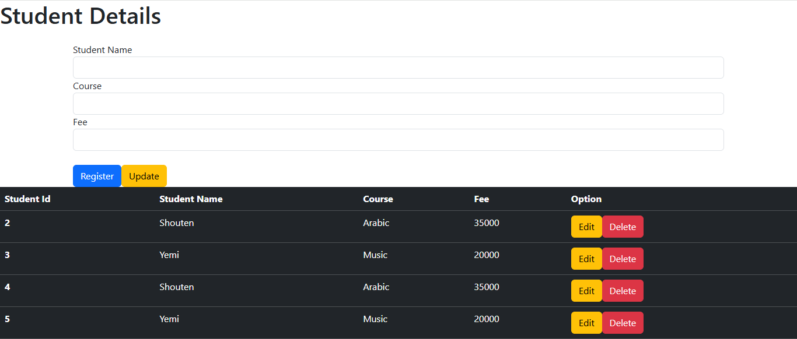

Membres du Groupe : 

GUEMTCHUENG KOM JOEL TD 45 

Présentation du Projet 

Nous avons dans le cadre de ce projet réalisé une application CRUD  de gestion étudiant c'est-à-dire
une application qui permet d'insérer un enregistrement étudiant avec ses différents champs, supprimer 
l'enregistrement , mettre à jour l'enregistrement et bien sûr consulter la liste des étudiants et des 
cours auxquels ils sont inscrits tout en affichant les montants des formations 

Prérequis pour exécuter le projet 

NodeJS : l'installation de NodeJS est indispensable a la réalisation de notre projet car nous voulons creer 
une application de gestion de cours auxquels sont inscrits des étudiants en écrivant notre API REST à l'aide de expressJS qui s'installe via npm (node package manager) 

PhpMyadMin : L'utilisation de PhpMyAdmin est indispensable car cette application nous permet de créer la base
de données qui va stocker les informations relatives à un(e) étudiant(e) et aux cours auxquels il/elle est inscrit(e)
Il est très important de souligner que sans base de données, le projet n'existe pas!!!!

Postman : Nous avons opté pour le logiciel Postman pour tester notre API Rest

Liste des enpoints de l'API : 

- POST : http://3001/api/student/add nous permet d'enregistrer un nouvel étudiant 
- GET : http://3001/api/student nous permet d'obtenir la liste de tous les étudiants présents dans la BD
- GET : http://3001/api/student/id nous permet d'obtenir des informations sur l'etudiant à partir de son id
- PUT : http://3001/api/student/update/id nous permet de mettre à jour les informations sur un étudiant à partir de son id
- DELETE : http://3001/api/student/delete/id nous permet de supprimer un enregistrement à partir de son id 

Fonctionnalités de l'interface utilisateur : 
- Création d'un étudiant , du cours auquel il est inscrit ainsi que les frais associés à ce cours
- Suppression d'un étudiant ainsi que les cours associés et bien évidemment les frais 
- Mise à jour d'un enregistrement étudiant 
- Lecture des différents enregistrements présents dans la base de données

Ci-dessous un aperçu de notre interface qui est ergonomique et facile d'utilisation

